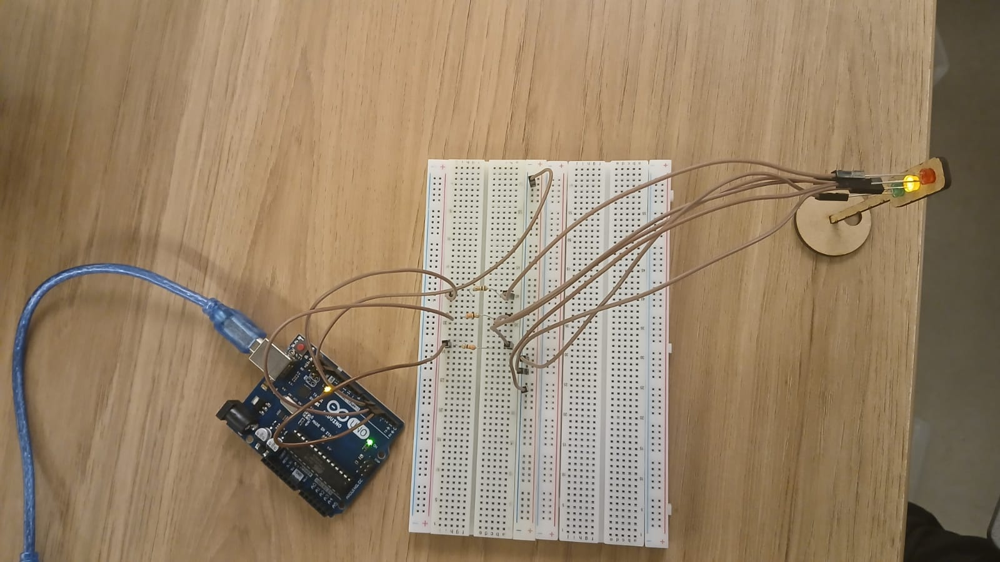

# Semáforo Offline
### Atividade Ponderada de Programação - Módulo 04 - 2024

Parte 1: Montagem Física do Semáforo
Inicialmente, foi realizada a montagem física de um semáforo utilizando LEDs e resistores em uma protoboard. Os LEDs representam as cores vermelho, amarelo e verde, seguindo o esquema de um semáforo convencional.

<div align="center">
<sup>Figura 1 - Protótipo Físico do Semáforo.</sup>

<sub>Fonte: Material produzido pelo autor(2024).</sub>
</div>

Os componentes utilizados na montagem do protótipo físico estão descritos a seguir:

<div align="center">
<sup>Quadro 1 - Lista de materias do protótipo físico.</sup>

| Componente | Quantidade | Observações |
|---|---|---|
| LED | 3 | Cores: Verde, Amarelo e Vermelho. |
| Jumper Macho-Fêmea | 6 | N/A. |
| Jumper Macho-Macho | 4 | N/A. |
| Arduino UNO | 1 | N/A. |
| Cabo USB para Arduino | 1 | N/A. |
| Resistores | 3 | Os resistores utilizados tinham X ohms de resistência. |
| Semáforo de MDF | 1 | Produzido com corte a laser no laboratório do Inteli. |


<sub>Fonte: Material produzido pelo autor(2024).</sub>
</div>

Parte 2: Programação e Lógica do Semáforo
O comportamento do semáforo foi programado para alternar entre as fases vermelho, amarelo e verde, seguindo a lógica abaixo:
- 6 segundos no vermelho
- 2 segundos no amarelo
- 2 segundos no verde
- +2 segundos no verde (simulando um tempo adicional para pedestres terminarem a travessia)
- 2 segundos no amarelo

Esse ciclo é repetido continuamente em um loop.

Nesse sentido, o código para controle das luzes do semáforo está disponível a seguir. O código foi testado para verificar o funcionamento correto, com as transições e com a temporização exata solicitada.

```// Definição dos pinos dos LEDs CÓDIGO COMENTADO
const int ledVermelho = 3;
const int ledAmarelo = 4;
const int ledVerde = 5;

// Variáveis para controle de tempo CÓDIGO COMENTADO
unsigned long tempoAnterior = 0;
int estado = 0;

void setup() { CÓDIGO COMENTADO CÓDIGO CÓDIGO COMENTADOCÓDIGO COMENTADOCÓDIGO COMENTADOCÓDIGO COMENTADO 
  pinMode(ledVermelho, OUTPUT);
  pinMode(ledAmarelo, OUTPUT);
  pinMode(ledVerde, OUTPUT);
}

void loop() {
  // Tempo atual em milissegundos
  unsigned long tempoAtual = millis();

  switch (estado) {
    case 0: // Fase Vermelha (6 segundos)
      if (tempoAtual - tempoAnterior >= 6000) {
        tempoAnterior = tempoAtual;
        digitalWrite(ledVermelho, LOW);
        digitalWrite(ledAmarelo, HIGH);
        estado = 1;
      } else {
        digitalWrite(ledVermelho, HIGH);
        digitalWrite(ledAmarelo, LOW);
        digitalWrite(ledVerde, LOW);
      }
      break;

    case 1: // Fase Amarela (2 segundos)
      if (tempoAtual - tempoAnterior >= 2000) {
        tempoAnterior = tempoAtual;
        digitalWrite(ledAmarelo, LOW);
        digitalWrite(ledVerde, HIGH);
        estado = 2;
      }
      break;

    case 2: // Fase Verde - Parte 1 (2 segundos)
      if (tempoAtual - tempoAnterior >= 2000) {
        tempoAnterior = tempoAtual;
        estado = 3; // Passa para a Parte 2 do verde
      }
      break;

    case 3: // Fase Verde - Parte 2 (2 segundos adicionais)
      if (tempoAtual - tempoAnterior >= 2000) {
        tempoAnterior = tempoAtual;
        digitalWrite(ledVerde, LOW);
        digitalWrite(ledAmarelo, HIGH);
        estado = 4; // Passa para a fase amarela
      }
      break;

    case 4: // Fase Amarela (2 segundos antes de voltar ao vermelho)
      if (tempoAtual - tempoAnterior >= 2000) {
        tempoAnterior = tempoAtual;
        digitalWrite(ledAmarelo, LOW);
        digitalWrite(ledVermelho, HIGH);
        estado = 0; // Retorna à fase Vermelha
      }
  break;
    }
}
```

Vídeo de demonstração

O vídeo de demonstração do protótipo funcionando pode ser visualizado no link: <a src="https://youtu.be/ZxEirt6jAQ8">aqui</a>.


Parte 3: Avaliação de Pares

Avaliação em Pares

Renan Reis
2,8 - A montagem está ótima, os fios estão um pouco confusos mas foi possível entender e os resistores foram utilizados corretamente.
3 - Os tempos estão corretos
3 - As fases estão certas e o código possui comentários claros
1 - Adicionou na madeira do semáforo 

Vinícius Testa
3 - A montagem está completa.
3 - A temporização está correta conforme solicitação do professor.
3 - As fases e transições estão certas. Código comentado.
1 - Adicionou o semáforo em pé

Observações 

A seção de avaliação em pares deveria ter sido adicionada até às 16h do dia da aula, contudo, por dificuldades técnicas com o versionamento git, eu não consegui fazer o commit até o horário estipulado no dia. Nesse sentido, segue a imagem que descreve o meu problema técnico e a realização da avaliação em pares dentro do prazo estipulado:

<div align="center">
<sup>Figura 2 - Screenshot da avaliação dentro do prazo estipulado.</sup>

<sub>Fonte: Material produzido pelo autor(2024).</sub>
</div>